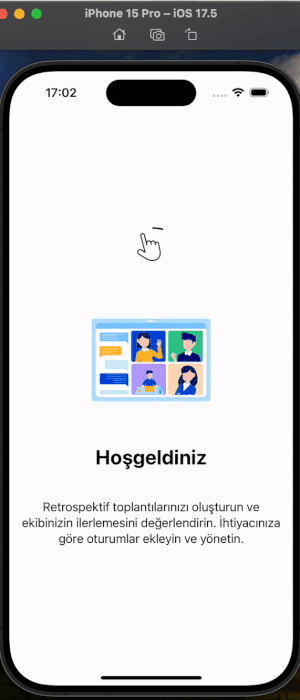
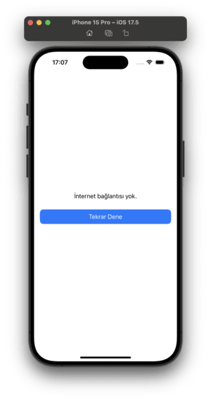
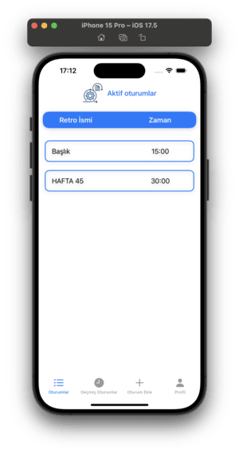
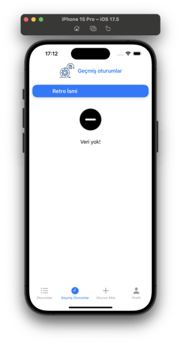
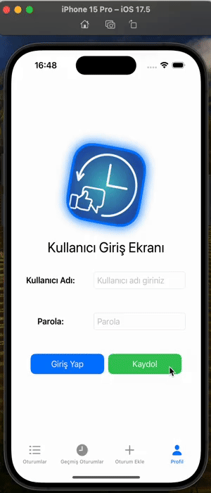

# Retrospective App

## Proje Açıklaması
Retrospective App, kullanıcıların geribildirim toplamasını ve değerlendirmesini kolaylaştıran bir SwiftUI uygulamasıdır. Kullanıcılar, farklı oturumlar oluşturarak, belirlenen konular üzerine ister anonim olarak ister isimleri gözükecek şekilde yorum yapabilir ve geri bildirimlerde bulunabilir. Dilerse oturumu oluşturan kişi de oturumu tamamen anonim veya isimler gözükebilecek şekilde ayarlayabilmektedir. Uygulama Firebase ile entegre edilmiştir, böylece veriler bulutta saklanır ve gerçek zamanlı olarak senkronize edilir.

## Özellikler
- İnternet kontrolü
- Onboarding ekranı
- Oturum oluşturma
- Yorum ekleme, silme ve kolon içi ve kolonlar arası taşıma
- Gerçek zamanlı veri senkronizasyonu
- Esnek ve kullanıcı dostu arayüz
- Eski oturumlarda zamanlayıcı ve düzenleme işlevlerinin devre dışı bırakılması
- Kullanıcılar arasında bağlantı paylaşımı için QR kod oluşturma
- Firebase authentication ile kullanıcı işlemleri
- Firebase crashlytics ile uygulama crashlerini takip etme

## Kurulum

### Gereksinimler
- Xcode 12.0+ 
- Swift 5.3+
- CocoaPods (Firebase bağımlılıkları için)

### Adımlar
1. Bu projeyi yerel bilgisayarınıza klonlayın:
    ```bash
    git clone https://github.com/kullaniciadi/retrospective-app.git
    cd retrospective-app
    ```

2. Xcode'da projeyi açın:
    ```bash
    open Retrospective.xcworkspace
    ```

3. Firebase yapılandırmanızı yapın:
    - `GoogleService-Info.plist` dosyasını Firebase Console'dan indirin ve projeye ekleyin

4. Gerekli paketleri Swift Package Manager ile yükleyin:
    - Xcode'da projeyi açtıktan sonra, proje ayarlarında "Swift Packages" sekmesine gidin. Ardından Firebase gibi gerekli paketleri ekleyin ve güncellenmesini sağlayın.
    

5. Projeyi çalıştırın:
    - Xcode'da hedef cihazınızı seçin ve `Cmd + R` ile çalıştırın.

## Kullanım
1. Uygulama başlatıldığında, mevcut oturumlar listesini göreceksiniz.
2. Yeni bir oturum eklemek için `+` düğmesine tıklayın.
3. Oturuma bir ad ve şifre belirleyin, zamanlayıcı ayarlarını yapın ve `Devam Et` butonuyla ilerleyin.
4. Kolonları ekleyin ve oturumu oluşturun. Toplantıya katılımcılarlı davet edin ve geribildirimleri paylaşın.
5. Eski oturumları görüntülerken düzenleme özellikleri devre dışı bırakılacaktır.
6. Oturumda kullanıcıların isimlerinin gözükme özelliği açıksa profil sekmesinden isminizin gözükmesi özelliğini kapatabilirsiniz.

## Testler
Birimi ve UI testlerini çalıştırmak için aşağıdaki adımları izleyin:

1. Xcode'da test hedefini seçin.
2. `Cmd + U` tuşlarına basarak tüm testleri çalıştırın.
3. Testlerin sonuçlarını kontrol edin.

## Kullanılan Teknolojiler

- **SwiftUI**: Kullanıcı arayüzü geliştirme için modern ve deklaratif bir framework.
- **Firebase Realtime Database**: Gerçek zamanlı veri senkronizasyonu ve bulut depolama için.
- **Firebase Crashlytics**: Uygulama çökmelerini izleme ve raporlama için.
- **Firebase Authentication**: Kullanıcı kimlik doğrulama işlemleri için.
- **XCTest**: Birim ve UI testleri için Apple’ın yerel test framework'ü.
- **SPM**: Harici bağımlılıkları yönetmek için kullanılan bağımlılık yönetim aracı.
- **MVVM (Model-View-ViewModel)**: Uygulamanın yapılandırılması ve veri akışının yönetimi için kullanılan mimari desen.
- **SwiftLint**: Kod standartlarını sağlamak ve kod kalitesini artırmak için kullanılan bir linting aracı.
- **SourceTree**: Git versiyon kontrolü için kullanılan görsel bir araç.
- **QR Kod Oluşturma**: Kullanıcılar arasında oturum bağlantılarını paylaşmak için QR kodları oluşturma özelliği.

## Ekran Görüntüleri

### Onboarding
| Ekran Görüntüsü  | Açıklama  |
| ---------------- | --------- |
|  | Kurulum ekranı. |

### İnternet Kontrolü
| Ekran Görüntüsü  | Açıklama  |
| ---------------- | --------- |
|  | İnternet kontrolü. |

### Ana Ekran
| Ekran Görüntüsü  | Açıklama  |
| ---------------- | --------- |
|  | Ana ekranın genel görünümü. Uygulama başlatıldığında kullanıcıları karşılayan ekran. |


### Boş Tablo
| Ekran Görüntüsü  | Açıklama  |
| ---------------- | --------- |
|  | Oturumlar tablosunun boş olduğunu gösteren ekran. |

### Oturum Ekle
| Ekran Görüntüsü  | Açıklama  |
| ---------------- | --------- |
|  | Kullanıcının oturum eklediği ekran. |

### Oturum Girişi
| Ekran Görüntüsü  | Açıklama  |
| ---------------- | --------- |
|  | Kullanıcıdan oturum girişinde şifre alımı. |

### Oturum Detayları
| Ekran Görüntüsü  | Açıklama  |
| ---------------- | --------- |

### Profil Ekranı
| Ekran Görüntüsü  | Açıklama  |
| ---------------- | --------- |
|  | Kullanıcının giriş kayıt işlemleri yaptığı ekran. |

## Katkıda Bulunma
Katkıda bulunmak isterseniz, lütfen aşağıdaki adımları izleyin:

1. Bu projeyi fork edin.
2. Yeni bir branch oluşturun: `git checkout -b feature/özellik-adi`
3. Değişikliklerinizi commit edin: `git commit -m 'Özellik ekle'`
4. Branch'inizi push edin: `git push origin feature/özellik-adi`
5. Bir pull request açın.

## Lisans
Bu proje MIT Lisansı altında lisanslanmıştır - ayrıntılar için `LICENSE` dosyasına bakın.
